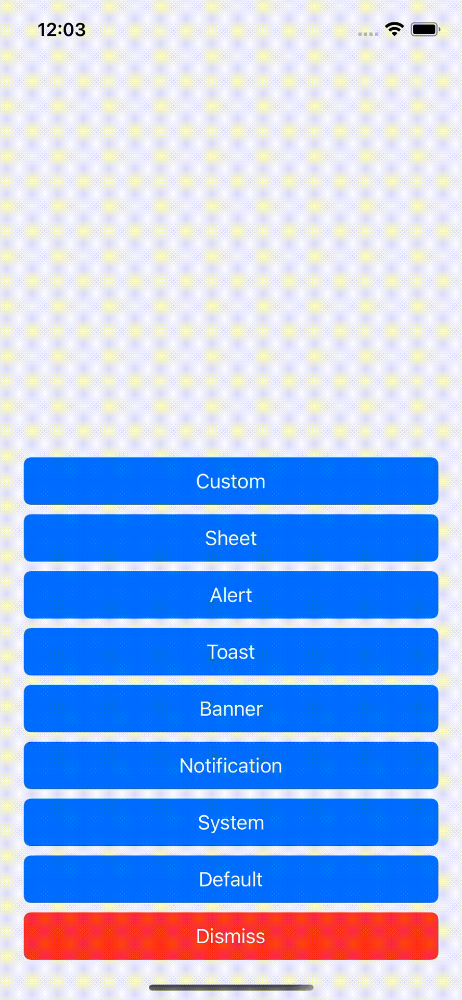
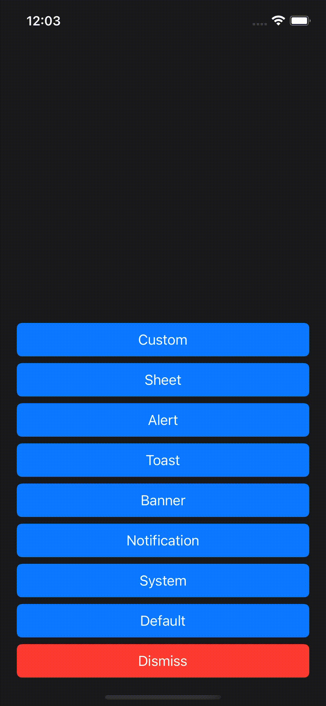
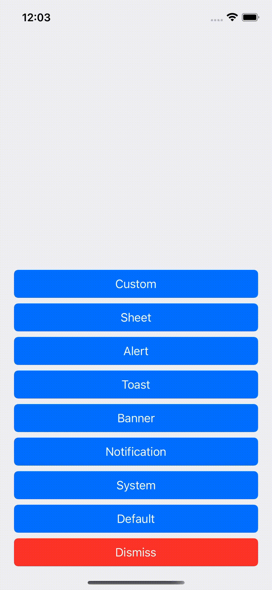
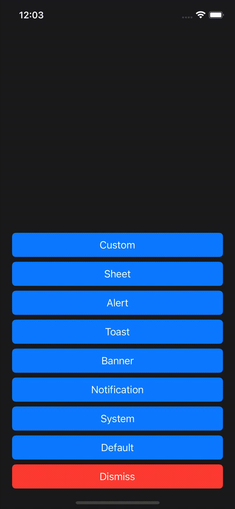
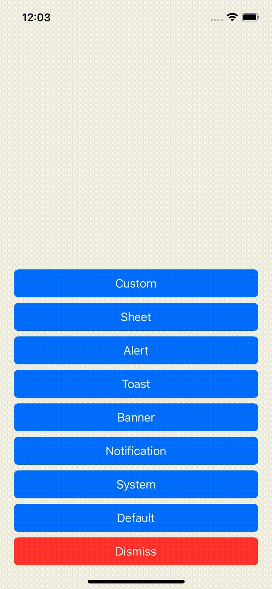
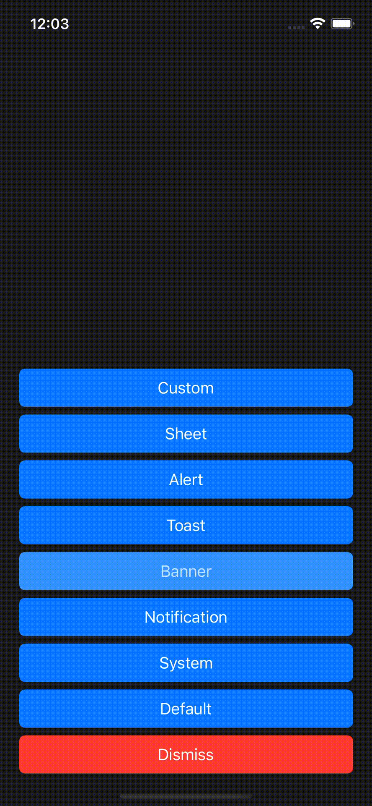
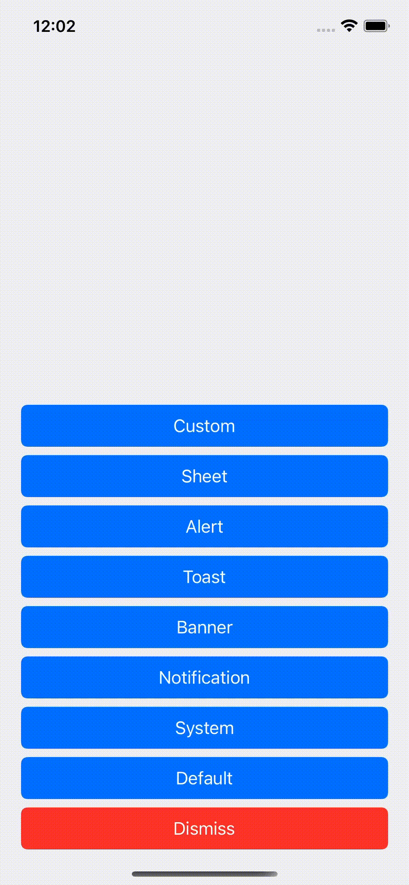

[](http://cocoapods.org/pods/Cardboard)


[](http://cocoapods.org/pods/Cardboard)

## Overview

Cardboard is a customizable modal-card library for iOS

<table>
  <tr>
    <td style="border-color:transparent"></td>
    <td style="border-color:transparent"></td>
    <td style="border-color:transparent"></td>
  </tr>
</table>
<table>
  <tr>
    <td style="border-color:transparent"></td>
    <td style="border-color:transparent"></td>
    <td style="border-color:transparent"></td>
    <td style="border-color:transparent"></td>
  </tr>
</table>

## Installation

### CocoaPods
Cardboard is integrated with CocoaPods!

1. Add the following to your `Podfile`:
```
use_frameworks!
pod 'Cardboard', '~> 1.0'
```
2. In your project directory, run `pod install`
3. Import the `Cardboard` module wherever you need it
4. Profit

### Manually
You can also manually add the source files to your project

1. Clone this git repo
2. Add all the Swift files in the `Cardboard/` subdirectory to your project
3. Profit

## Cardboard

Cardboard is a modal-card presentation & customization system built with speed and simplicity in mind.

It's also the spiritual-successor of [Bulletin](https://github.com/mitchtreece/Bulletin)

### Usage

Getting started with Cardboard is dead simple! All you need to do is make a custom card content view, and present it:

*CustomCardView.swift*
```swift
import UIKit
import Cardboard

class CustomCardView: CardContentView {
    ...
}
```

CustomViewController.swift
```swift
import UIKit
import Cardboard

class CustomViewController: UIViewController {

    override func viewDidAppear(_ animated: Bool) {

        super.viewDidAppear(animated)

        Card
            .defaultModal(CustomCardView())
            .present(from: self)

    }

}
```

### Customization

Cardboard comes with some built-in style options:

- **defaultModal**: a standard bottom slide-up card
- **system**: a card styled like the iOS 13 system "chip" cards (i.e. AirPods)
- **notification**: a top slide-down notification card
- **banner**: a top slide-down banner card
- **toast**: a bottom slide-up toast card
- **alert**: a centered alert-style card

But of course, the styling doesn't stop there! Cardboard has a robust customization system that you can abuse to your heart's content 🤪

```swift
let view = CustomCardView()

Card(view) { make in

    make.anchor = .bottom
    make.statusBar = .lightContent
    make.contentOverlay = .color(.black.withAlphaComponent(0.8))
    make.corners.roundedCornerRadius = 32
    make.animator = MyCustomCardAnimator()
    make.edges.setInsets(12, for: [.left, .right])
    make.edges.setInset(12, for: .bottom, when: .safeArea(false))
    make.edges.safeAreaAvoidance(.card)

}
.present(from: self)
```

You like one of the built-in styles, but want to slightly tweak it? You can build on-top of existing styles to quickly get the effect you're looking for:

```swift
let view = CustomCardView()

Card.notification(view) { make in

    make.anchor = .bottom
    make.corners.roundedCornerRadius = 8

}
.present(from: self)
```

You can adjust almost every aspect of a card, right down to what kinds of interactions you want it to support 🎉

### Edges, Insets, & Safe Areas

With the amount of devices, screen features, & ways your app's interface can be setup, it's no surprise that managing view display properties can become complicated - especially when supporting a large list of devices. To help ease the pain, Cardboard was built with flexibility in mind. Configuring a card to be displayed simultaneously on modern (iPhone X - like devices; i.e. rounded screen corners, notch, home grabber, etc) & legacy (no screen corners, notch, or home grabber) devices is as easy as specifying some edge-inset rules, conditions, & safe-area avoidance modes:

```swift
let view = CustomCardView()

Card.defaultModal(view) { make in

  make.corners.roundedCorners = .allCorners

  make.edges.setInsets(20, for: [.left, .right])
  make.edges.setInset(20, for: .bottom, when: .safeArea(false))
  make.edges.setInset(8, for: .top, when: .safeAreaLegacyStatusBar)
  make.edges.setSafeAreaAvoidance(.card, for: [.top, .bottom])

}
```

The above example builds off of the `defaultModal` card style, and configures the card for display on modern & legacy devices. Let's break it down:

```swift
make.edges.setInsets(20, for: [.left, .right])
```

This **always** sets the left & right edge insets to `20`.

```swift
make.edges.setInset(20, for: .bottom, when: .safeArea(false))
```

This sets the bottom edge inset to `20` **if** that edge does not have a safe-area inset value.

```swift
make.edges.setInset(8, for: .top, when: .safeAreaLegacyStatusBar)
```

This sets the top edge inset to `8` **if** that edge's safe-area inset value is equal to the legacy status-bar height (i.e. `20`).

```swift
make.edges.setSafeAreaAvoidance(.card, for: [.top, .bottom])
```

This sets the top & bottom edge safe-area avoidance mode to **card**. When the card is presented in this mode, the specified edge's will be anchored to the safe-area. If you specify a **content** safe-area avoidance mode, the card will intead be anchored to it's superview & your **custom content view** will be offset by the safe-area value for those respective edges. 

It's good to note that insets are still applied after safe-area calculations. In the above example, the top inset of `8` will be added to the top safe-area offset (in this case the status-bar's height) if the condition is met - resulting in a total top inset of: `28`.

## TODO
- **Card Presentation Levels**: As of now, all cards are presented from a *source* view controller. However, there are some situations where it would be more useful to present on something more "global" (i.e. at a window-level). This could be for something like presenting notification cards over an entire application - instead of just over a single view controller.

- **Card Queuing**: Right now, all cards are presented immediately without any context as to other cards / presentations. Instead of always presenting immediately, being able to "enqueue" a card for presentation would be helpful in several scenarios. For example, imagine presenting notification cards. You might only want one notification to be active at a time (this is how the iOS notification system works). Having a queuing system would allow us to achieve this.

## Contributing
Pull-requests are more than welcome. Bug fix? Feature? Open a PR and we'll get it merged in!
